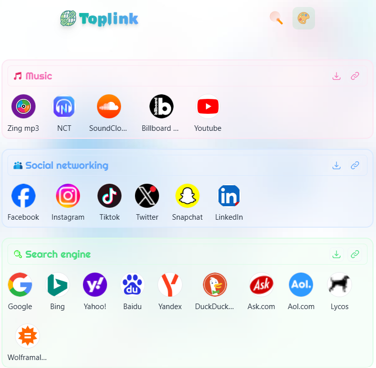

# Toplink

> 🌐 *Linking You to the Web's Finest: Explore - Connect - Click!*


[](https://github.com/antfu/eslint-config)

### 🔮 Preview

[Demo link](https://thuongtruong109.github.io/toplink)



### 💫 Tech stacks
This starter template also includes:

- [Tailwind CSS](https://github.com/tailwindlabs/tailwindcss)
- [Eslint](https://eslint.org)
- [Headless UI](https://headlessui.dev/vue/menu) - unstyled, fully accessible UI components, designed to integrate beautifully with Tailwind CSS
- [Icones](https://github.com/antfu/icones) - beautiful hand-crafted SVG icons with [Unocss](https://github.com/unocss/unocss) used. 
- [tailwindcss/forms](https://github.com/tailwindlabs/tailwindcss-forms)
- [tailwindcss/typography](https://github.com/tailwindlabs/tailwindcss-typography)
- [tailwindcss/line-clamp](https://github.com/tailwindlabs/tailwindcss-line-clamp)
- [tailwindcss/aspect-ratio](https://github.com/tailwindlabs/tailwindcss-aspect-ratio)
- [Pinia](https://github.com/posva/pinia)

### 📦 How to run

### 1. Install dependencies

```bash
$ npm install
```

#### 2. Run

```bash
$ npm run dev
```

#### 3. Build

```bash
$ npm run build
```

#### 4. Run linters & formatters

```bash
$ npm run lint
```

### 📅 Add data?

- Update in [assets/url](https://github.com/thuongtruong109/toplink/blob/main/assets/data.json)
- Check detailed instructions at [CONTRIBUTING](https://github.com/thuongtruong109/toplink/blob/main/.github/CONTRIBUTING.md)

### 🪪 License

By contributing, you agree that your contributions will be licensed under its [MIT License](../LICENSE).

<!-- ### 🔗 Refs -->
<!-- idea: https://www.xemm.me/ -->
<!-- tab: https://www.material-tailwind.com/docs/html/gallery -->
<!-- grid masonry: https://dev.to/kdrbek/responsive-masonry-layout-with-tailwindcss-in-2-steps-4kkj -->
<!-- Logo: https://img.icons8.com/pulsar-gradient/48/personal-hotspot.png -->